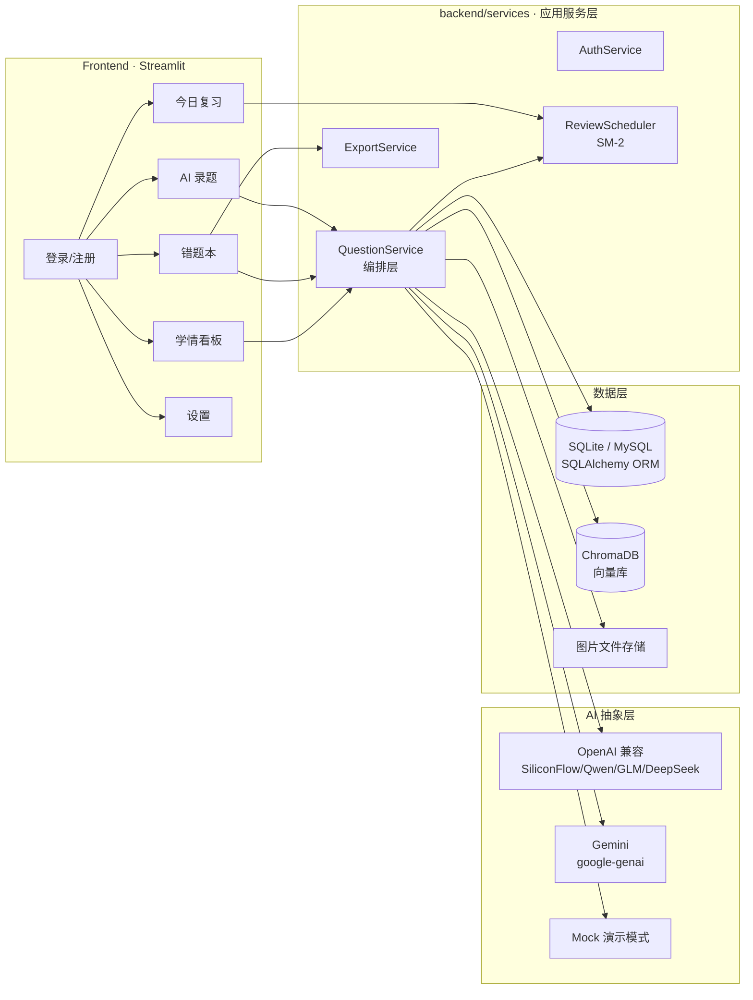

# 📘 MathMaster Edu — 基于视觉大模型与 RAG 的智能错题本

> **让错题管理像呼吸一样简单。** 拍照录入 → AI 结构化解析 → 向量归档 → 间隔重复复习 → 学情看板。
>
> A production-grade Smart Wrong-Question Notebook powered by a Vision LLM, RAG retrieval, and spaced-repetition scheduling.


[](https://github.com/lii-lii321/Math_Tutor_RAG/actions/workflows/ci.yml)


---

## ✨ 项目亮点 (Highlights)

| 能力 | 说明 |
|---|---|
| 📸 **AI 拍照录题** | 上传手写作业/试卷照片，视觉大模型识别题目并输出**结构化解析**（考点、分步讲解、答案、难度、易错原因、变式题），基于 Pydantic Schema 约束输出并稳健解析 |
| 🔁 **多模型提供商** | 统一 Provider 抽象：一套代码对接 **SiliconFlow / 通义千问 / 智谱 GLM / DeepSeek / OpenAI / Ollama / Gemini**，更换 `AI_BASE_URL` + `AI_MODEL` 即可切换；无 Key 时自动进入演示模式，克隆即可跑通 |
| 🧠 **RAG 向量检索** | ChromaDB 持久化向量库：错题解析自动嵌入入库；**「举一反三」相似题召回**、错题本**语义搜索**（自然语言找题）；向量库故障自动降级为关键词检索 |
| 🤖 **Agent + MCP** | Tool-use 对话 Agent（function calling 循环自主编排工具）+ MCP Server（Claude Desktop / Cursor 直接调用错题本）|
| ⏰ **间隔重复复习** | 内置 **SM-2 算法**（Anki 同源）：闪卡式复习，按记忆质量自动调度下次复习时间，对抗遗忘曲线 |
| 💬 **追问讲题** | 每道错题内置多轮对话（Chat UI）：带题目上下文的多轮讲题，上下文自动截断防超限 |
| 📊 **学情看板** | 知识点分布、**标签级掌握度估算**（结合复习表现与调度间隔）、薄弱知识点 Top N、近 14 天录入趋势 |
| 🖨️ **一键组卷导出** | 按筛选结果生成可打印 Word 复习卷，保留题目原图与答题留白 |
| 🔐 **生产级安全** | bcrypt 密码哈希、登录失败延迟、JWT 认证、Pydantic 入参校验、SQL 参数化查询 |
| 🔌 **FastAPI 网关** | 与 Streamlit 共享同一套 backend 服务的 REST API（JWT + OpenAPI 文档），Web / 小程序 / 脚本多端复用 |
| 🧩 **知识图谱** | 标签共现力导向图，直观呈现知识点之间的关联结构 |
| 👨‍🏫 **教师端** | 学生总览：全班错题量/待复习/掌握度/最近活跃，逐个查看学生知识点分布；错题批注 |
| 📅 **学习日历** | 90 天热力图 + 复习正确率趋势 + 掌握度成长曲线 + 连续学习打卡 + 周报环比 |
| ⌨️ **高效复习** | 键盘快捷键（空格/1-4）、评分间隔预览、跳过、掌握归档（🏆）、复习历史 |
| 🌙 **体验细节** | 深色模式、PWA 可安装、OCR 原图搜索（可选）、MUJI 极简界面 |
| 🧪 **工程化** | pytest 140 用例 + Playwright E2E、ruff、覆盖率 ~92%、CI（lint + 3 版本矩阵 + 启动冒烟 + E2E + Docker）、Alembic 迁移、Docker Compose 一键部署 |

## 🏗️ 架构 (Architecture)



**分层原则**：界面层（`frontend/`）只依赖应用服务（`QuestionService` 等）；服务层通过 Repository 访问数据库；AI 提供商与向量库均可替换/降级。配置集中在 `backend/config.py`（pydantic-settings 校验）。

## 🖼️ 界面速览 (Screenshots)

| 学情看板 | AI 录题 |
|---|---|
|  |  |
| **错题本** | **今日复习（SM-2 闪卡）** |
|  |  |
| **知识图谱（标签共现）** | **学生总览（教师端）** |
|  |  |
| **AI 助手（Agent 对话）** | |
|  | |
| **知识图谱（标签共现）** | |
|  | |

## 🚀 快速开始 (Quick Start)

### 方式一：本地运行（推荐 Python 3.10+）

```bash
git clone https://github.com/lii-lii321/Math_Tutor_RAG.git
cd Math_Tutor_RAG

python -m venv .venv
.venv\Scripts\pip install -r requirements.txt      # Windows
# source .venv/bin/activate && pip install -r requirements.txt   # macOS/Linux

streamlit run app.py
```

打开 http://localhost:8501 ，使用种子账号登录：

| 账号 | 密码 | 角色 |
|---|---|---|
| `admin` | `admin123` | 教师（可查看全部学生错题） |
| `demo` | `demo123` | 学生 |

> 未配置 AI Key 时应用以**演示模式**运行（返回内置示例解析），完整流程均可体验。

### 方式二：Docker 一键部署

```bash
docker compose up -d --build
# Web 访问 http://localhost:8501，REST API 访问 http://localhost:8000/docs
# 数据持久化于 named volume
```

### 方式三：单独启动 API 网关

```bash
pip install -r requirements.txt
uvicorn api.main:app --port 8000
# OpenAPI 文档: http://localhost:8000/docs
```

```bash
# 快速体验 API
curl -s -X POST http://localhost:8000/api/auth/login \
  -H "Content-Type: application/json" \
  -d '{"username": "demo", "password": "demo123"}'
# 返回 access_token，后续请求带 Authorization: Bearer <token>
```

> `.env` 中设置 `AUTH_SECRET` 为强随机密钥（≥ 32 字节）以保护 JWT 签名。

### 启动 MCP Server（Claude Desktop / Cursor 接入）

```bash
pip install -r requirements.txt
# Claude Desktop 的 claude_desktop_config.json 中添加：
# "mcpServers": { "mathmaster": { "command": "python", "args": ["-m", "mcp_server"],
#                 "cwd": "<项目路径>" } }
python -m mcp_server   # stdio 传输，验证可用
```

接入后即可在 MCP 客户端中用自然语言：搜索错题、录入错题、评分复习、查周报。

### 启用真实 AI 模型

复制 `.env.example` 为 `.env`，任选一家 OpenAI 兼容服务填入即可（也可接 Gemini 或本地 Ollama）：

```ini
AI_PROVIDER=openai_compatible
AI_BASE_URL=https://api.siliconflow.cn/v1
AI_API_KEY=sk-xxxx
AI_MODEL=Qwen/Qwen2.5-VL-32B-Instruct
```

可选：接入远程中文嵌入模型提升检索效果（默认使用 ChromaDB 内置本地模型，零外部依赖）：

```ini
EMBEDDING_BASE_URL=https://api.siliconflow.cn/v1
EMBEDDING_API_KEY=sk-xxxx
EMBEDDING_MODEL=BAAI/bge-m3
```

## 📖 功能导览

1. **AI 录题** — 上传错题照片 → 获得考点分析 / 分步讲解 / 答案 / 难度 / 易错原因 / 变式练习 → 自动归档并写入向量库 → 展示「举一反三」相似历史错题。多题混拍时先「从图中找题」：自动切出题目清单（疑似做错的题默认勾选），勾选确认后逐题解构入库；单题照片保持整图解析。
2. **错题本** — 关键词 + 语义双路搜索；按标签筛选；在线编辑（编辑后向量索引同步更新）；批量删除；一键导出 Word 复习卷；**追问讲题**多轮对话。
3. **今日复习** — 闪卡式复习：看题回忆 → 显示解析 → 按掌握程度评分（忘了/勉强/记得/秒懂）→ SM-2 自动安排下次复习时间。
4. **学情看板** — 累计错题、待复习数、知识点分布环形图、薄弱知识点掌握度条、近 14 天录入趋势。

## 🧩 K12 二次开发功能（本分支新增）

本分支在上游基座上做了面向 K12 场景的二次开发，与上游差异的完整清单见 **[docs/UPSTREAM_DIFF.md](docs/UPSTREAM_DIFF.md)**：

1. **K12 元数据** — 题目增加学段 / 年级 / 学科 / 教材版本等结构化字段，贯穿录入、检索、筛选与导出。
2. **整卷导入** — 上传整份试卷文档（`documents` 模块）→ 自动切题（`segment`）→ OCR 可选 → 逐题入库，异步任务跟踪进度（`jobs`）。
3. **同类题检测与降级** — 录题时检测公共题库 / 本人历史中的同类题（`detection`）；公共题库命中即复用解析并降级为「引用入库」，避免重复消耗 AI 额度（`demotion`）。
4. **约束检索与公共题库** — 向量检索支持按学段 / 年级 / 学科等元数据约束过滤（`RAG_FILTER_OVERSAMPLE` 过采样后过滤）；内置公共题库集合（`RAG_BANK_COLLECTION`，默认 `question_bank`），用 `python scripts/seed_question_bank.py` 灌入。
5. **数据整体迁移** — `python scripts/migrate_data.py --new-data-dir <绝对路径>` 把 SQLite 库 / uploads / 散落日志 / Chroma 向量库 / 内置模型缓存整体复制到新数据目录并逐项校验（文件数、字节数、DB 表行数），不删旧数据；MySQL 部署会提示改用 mysqldump。
6. **新配置项** — `CHROMA_MODEL_DIR`（内置嵌入模型缓存目录）、`RAG_LEAK_THRESHOLD` / `RAG_FILTER_OVERSAMPLE` / `RAG_BANK_COLLECTION`、`SHARE_CARD_FONT_PATH`（分享卡片字体，可配置避免系统路径硬编码）、`DOC_UPLOAD_PATH`、`OCR_ENABLED` 等，详见 `backend/config.py` 注释与 `.env.example`。
7. **语音模块** — 语音录入 / 播报（原 4.1 规划）**已明确延后**，不在本分支交付范围。

## 🧪 测试与质量

```bash
pip install -r requirements-dev.txt
pytest -v          # 41 个用例：认证 / 仓储 / SM-2 调度 / AI 解析 / RAG / 统计 / 导出
ruff check .       # 静态检查
```

GitHub Actions 在每次 push / PR 时执行：`ruff lint → pytest (3.10/3.11/3.12 矩阵) → Docker 构建`。

部署到服务器 / 云端的完整步骤（含 MySQL 切换、备份策略、常见问题）见 **[docs/DEPLOYMENT.md](docs/DEPLOYMENT.md)**。

## 📁 目录结构

```
Math_Tutor_RAG/
├── app.py                     # Streamlit 入口（路由 + 侧边栏）
├── api/                       # FastAPI 网关（REST API，多端复用）
│   ├── main.py                # 应用工厂 + CORS + OpenAPI
│   ├── deps.py                # JWT 认证 / 会话依赖
│   └── routers/               # auth / questions / review / stats
├── backend/
│   ├── config.py              # pydantic-settings 配置中心
│   ├── database.py            # SQLAlchemy 引擎 / 会话 / 初始化
│   ├── models/
│   │   ├── orm.py             # User / Question / ReviewLog
│   │   └── schemas.py         # Pydantic 契约（含 AI 结构化输出 Schema）
│   ├── repositories/          # 数据访问层（用户 / 错题）
│   ├── services/
│   │   ├── ai/                # AI 提供商抽象：OpenAI 兼容 / Gemini / Mock
│   │   ├── rag.py             # ChromaDB 向量库封装（含降级策略）
│   │   ├── review.py          # SM-2 间隔重复调度器
│   │   ├── stats.py           # 标签统计 / 掌握度 / 活跃度
│   │   ├── auth.py            # 认证服务
│   │   ├── export.py          # Word 组卷导出
│   │   └── question_service.py# 错题编排服务（界面层唯一入口）
│   └── utils/                 # 日志 / 密码哈希
├── frontend/
│   ├── pages/                 # auth / dashboard / tutor / notebook / review / settings
│   ├── common.py              # 样式、缓存、公共组件
│   └── assets/style.css       # MUJI 极简主题
├── tests/                     # pytest 测试套件
├── scripts/
│   ├── install_onnx_model.py  # 断点续传安装内置嵌入模型（弱网友好）
│   ├── seed_question_bank.py  # 灌入公共题库（配合同类题检测）
│   ├── migrate_data.py        # 数据目录整体迁移（复制+校验，不删旧数据）
│   └── setup_env.ps1/.sh      # 全新环境一键部署脚本
├── docs/ARCHITECTURE.md       # 架构决策说明
├── Dockerfile / docker-compose.yml
└── .github/workflows/ci.yml   # lint + 测试矩阵 + Docker 构建
```

## 💾 数据落在哪里

运行时数据默认在项目内 `data/`，可通过 `.env` 整体挪到独立数据盘（与代码、`.venv` 分离）：

```ini
DATA_DIR=D:\workspace\learning-tour\data              # SQLite 库 / 上传原图 / 遥测日志
CHROMA_DIR=D:\workspace\learning-tour\data\chroma     # 向量库
CHROMA_MODEL_DIR=D:\workspace\learning-tour\data\models\onnx   # 内置嵌入模型缓存
```

- `DATABASE_URL` 留空时，SQLite 自动落在 `{DATA_DIR}/math_tutor.db`；也可显式写绝对路径或切 MySQL。
- 未配置远程 `EMBEDDING_*` 时用 ChromaDB 内置 `all-MiniLM-L6-v2`。其官方缓存位置在用户主目录
  （`~/.cache/chroma/onnx_models`）且**不支持断点续传**，弱网容易反复下一半。
  用 `python scripts/install_onnx_model.py` 可断点续传装到 `CHROMA_MODEL_DIR` 并自动校验 SHA256。
- 启动后在「设置 → 存储」可以看到当前实际生效的路径。
- 已有部署想整体挪数据目录：先停服务，再跑 `python scripts/migrate_data.py --new-data-dir <新绝对路径>`
  （可加 `--dry-run` 预演），校验通过后按脚本结尾提示更新 `.env`；旧数据默认保留作备份。
- 公共题库灌入：`python scripts/seed_question_bank.py`（配合 `RAG_BANK_COLLECTION`）。
- **老库升级表结构**：应用启动走 `create_all`，不会给已存在的表加新列。若旧库在 K12 二次开发前创建
  （报 `no such column: questions.subject` 之类错误），先备份 `.db` 文件，再执行：
  `python -m alembic stamp b98b7ec07b27 && python -m alembic upgrade head`
  （`b98b7ec07b27` 是 jobs 表版本；若启动时 `create_all` 已自动建过空的 `detection_logs`，先删掉该空表再执行）。

## 🗺️ 路线图 (Roadmap)

- [x] ~~知识点图谱可视化（标签共现网络）~~（v2.1）
- [x] ~~FastAPI 网关化以便多端复用~~（v2.1）
- [x] ~~学习日历热力图 / 正确率趋势 / 连续学习打卡~~（v2.1）
- [x] ~~教师端学生总览~~（v2.1）
- [ ] PostgreSQL 支持；对象存储（S3/OSS）托管题目图片
- [ ] OpenTelemetry 观测埋点；消息队列异步解析
- [ ] 语音录入 / 语音播报（**本分支已登记延后**，见 docs/UPSTREAM_DIFF.md P4 节）

## ⚠️ 已知限制 (Known Limitations)

- 登录失败限流为进程内实现，多实例部署需换用 Redis 等共享存储
- 语义搜索的向量检索范围：学生仅本人错题；教师为 自己 + 全部学生
- 错题图片存储于本地磁盘（`data/images/`），云对象存储接入在路线图中

## 📄 License

[MIT](LICENSE)
