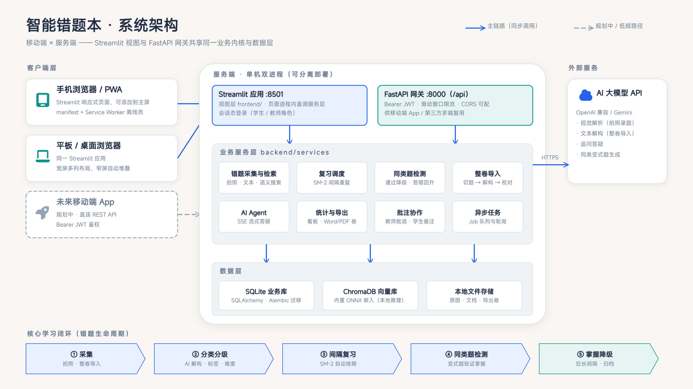
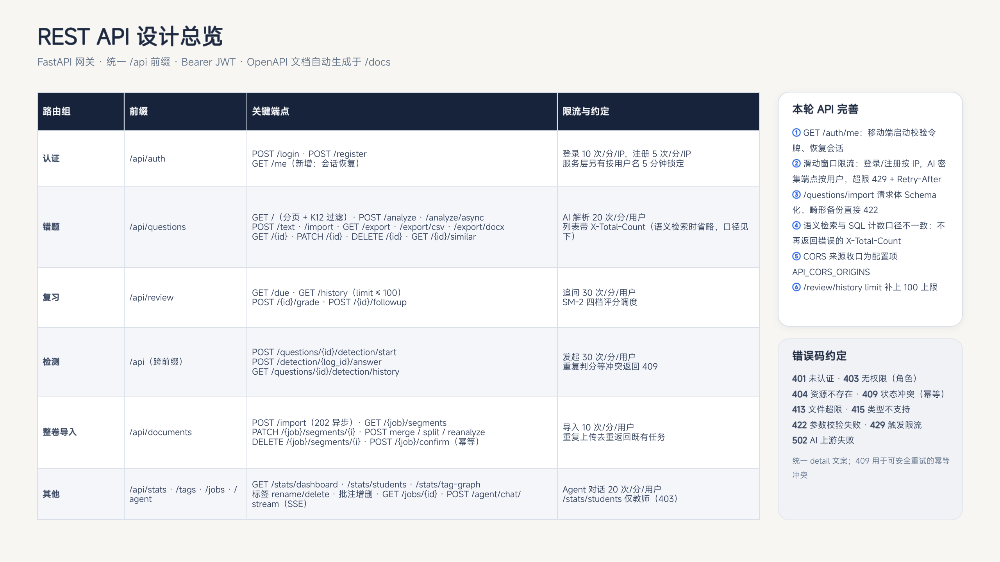
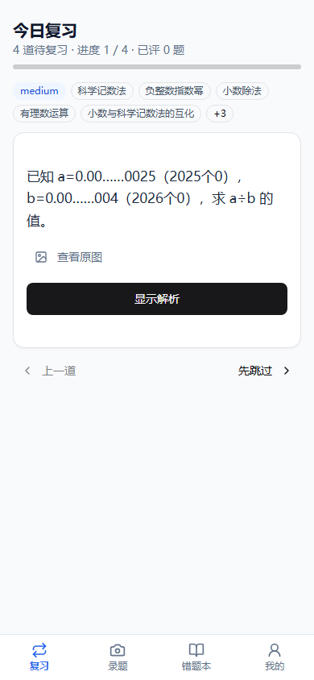
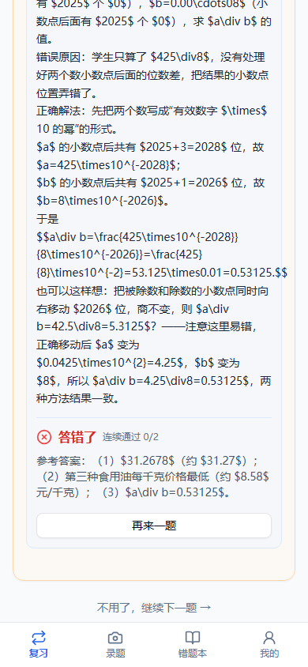
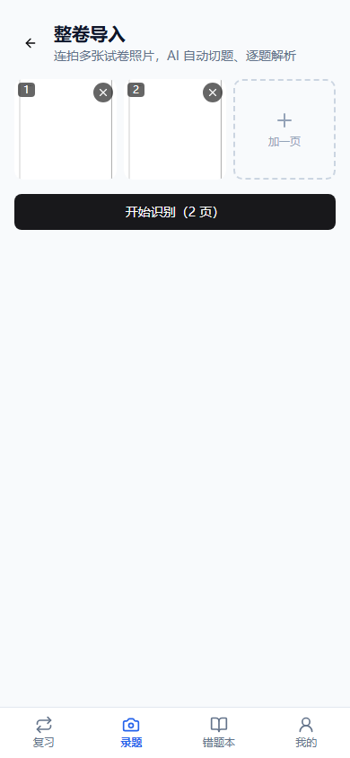
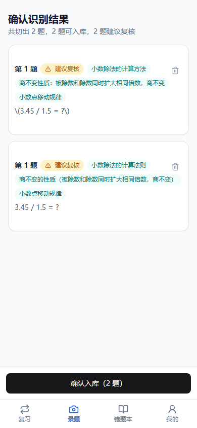
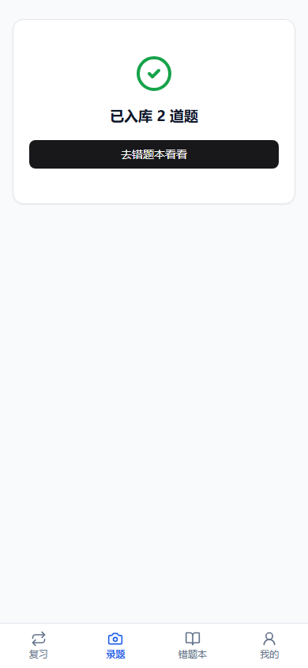

# 架构决策说明 (Architecture Notes)

本文记录重构与迭代中的关键技术决策，便于面试交流与后续演进。

## 0. 服务组合（v2.2）

`QuestionService` 曾是 662 行的单类，已按领域拆分为 Mixin 组合（`question_mixins.py`）：
`EntryMixin`（录入）/ `QueryMixin`（检索）/ `EditTagMixin`（编辑与标签）/ `ReviewMixin`（复习与追问）/ `BackupMixin`（备份导出）/ `StatsMixin`(统计) + `CoreMixin`（会话/配置/索引等基础设施）。
公共 API 不变，调用方零改动。

## 1. 总体分层

移动端 + 服务端全景架构与 REST API 设计总览（可编辑源文件见仓库外 `architecture/architecture.kanva.pptd`）：





```
frontend (Streamlit views)
      │  只依赖
      ▼
services (应用服务层：QuestionService / AuthService / ReviewScheduler ...)
      │  通过
      ▼
repositories (数据访问层，SQLAlchemy ORM)
      │
      ▼
SQLite / MySQL  +  ChromaDB  +  文件存储
```

- **界面层零业务逻辑**：页面组件只做交互编排，所有写入/检索/调度都走服务层。可复用展示组件集中在 `frontend/components.py`（详情视图 / 重测 / 变式入库 / 命中高亮），文案集中在 `frontend/i18n.py`。
- **session-per-operation**：`QuestionService` 每个公开方法内部开短事务。Streamlit 的执行模型是「脚本反复重跑 + 多线程渲染」，持有长事务既容易跨请求泄漏又会出现 SQLite 写锁竞争。
- **依赖注入点**：`QuestionService(session_factory=...)` 接受会话工厂注入，测试可直接替换。

## 2. AI 提供商抽象

`BaseAIProvider` 定义唯一接口 `analyze_question(image, mime, hint) -> QuestionAnalysis`：

| 实现 | 适用 |
|---|---|
| `OpenAICompatProvider` | SiliconFlow / 通义 / GLM / DeepSeek / OpenAI / Ollama —— 国内生态主流接入方式 |
| `GeminiProvider` | Google Gemini（新一代 `google-genai` SDK） |
| `MockProvider` | 无 Key 演示模式，评审克隆即可跑通全链路 |

**结构化输出**：提示词要求严格 JSON；`parse_analysis` 兼容纯 JSON / ```json 围栏 / 前后夹杂说明文字三种形态，解析结果经 `QuestionAnalysis`（Pydantic）校验；失败按 `AI_MAX_RETRIES` 重试。选择「提示词 + 稳健解析」而非 JSON Schema 强约束，是因为兼容层覆盖的第三方服务商对 `response_format=json_schema` 支持参差。

**题目完整性 + 小题聚焦（v2.3）**：`QuestionAnalysis` 新增 `is_complete` / `completeness_note` / `focused_sub_question` 三字段。系统提示词要求模型先检查题目是否拍全，再按批改痕迹（打叉/扣分/红笔）或学生补充说明定位做错的小题；`focused_sub_question` 非空时入库题面 = 小题题干 + 分隔线 + 解析（图片与文本两条录入路径一致），复习闪卡与错题本据此分离题面/解析。移动端录题结果页对「没拍全」给 amber 警告、对「按小题录入」给确认提示。实测 deepseek-flash 对长 JSON 末位字段服从性不稳定，关键指令需在系统提示词、用户提示词与字段说明三处重复锚定。

## 3. RAG 设计

- **嵌入策略**：配置了远程嵌入接口（如 BGE-M3）则用之；否则用 ChromaDB 内置本地 ONNX 模型，保持零外部依赖、离线可用。
- **三个消费场景**：① 录题后相似题召回（举一反三）；② 错题本语义搜索与关键词检索双路合并去重；③（隐式）标签/考点文本参与嵌入，提升召回相关性。
- **降级策略**：向量库初始化/读写任何异常 → 记日志并降级为关键词检索，主流程永不阻断（`is_available()` 供设置页展示运行状态）。
- **一致性**：错题编辑后同步 `upsert` 向量；删除错题同步删除向量。
- **同类题约束召回（题型硬过滤）**：`SimilarConstraints` 含题型维度，`matches_constraints` 中学科与题型为**全程硬过滤**（放宽阶梯所有层级生效，level 4 也不例外）——应用题/计算题即使知识点相同也不互为同类，库内无同题型候选时宁可空集回落公共题库/AI 生成。题型匹配带相容组：{应用题, 解答题} 互认（AI 标注常在两者间摇摆）；元数据键缺失放行（旧向量兼容）。AI 变式兜底提示词同步锁题型（应用题不得退化为纯计算题）。既有向量用 `scripts/reindex_vectors.py` 一次性补写题型元数据；公共种子题库按模板标注真实题型（`seed_question_bank.py`）。

## 4. SM-2 复习调度

- `grade ∈ {again, hard, good, easy}` 映射经典质量分 `q ∈ {0, 3, 4, 5}`。
- `q < 3`：进度重置（reps=0），`REVIEW_AGAIN_MINUTES`（默认 10 分钟）后重现。
- `q ≥ 3`：reps 1→间隔 1 天，reps 2→6 天，之后 `interval × ease`；ease 按 SM-2 公式演进，下限 1.3。
- 每次复习写入 `review_logs` 明细（grade/quality/前后间隔/ease），是掌握度估算的数据来源。

**掌握度定义**（启发式，服务于看板而非论文）：标签内复习记录中 good/easy 占比 × 0.7 + 平均调度间隔归一化 × 0.3；无复习记录为 0。

## 3.5 追问讲题（多轮对话）

`BaseAIProvider.answer_followup(context, history, question)` 围绕一道已解析错题构建消息序列：
`system（讲师人设 + 题目背景）→ 最近 12 条历史 → 当前问题`。截断历史防止 token 超限；
服务层先校验题目归属（`get_owned`）再发起对话；对话历史按题隔离存于 `st.session_state`。

## 5. 数据与安全

- 默认 SQLite（WAL 模式 + busy timeout 30s，规避 Streamlit 多线程下的 `database is locked`）；`DATABASE_URL` 一键切换 MySQL/PostgreSQL。
- 密码仅存 bcrypt 哈希（rounds 可配）；登录失败固定延迟 1s 抑制枚举。
- 所有入参（注册表单、AI 响应、标签输入）经 Pydantic 校验；SQL 全部参数化。

## 6. 前端选型

保留 Streamlit（数据应用交付效率最高），配合：
- 组件级 MUJI 主题（藏青 #1a365d / 石板灰 #334155 / 蓝 #2563eb，禁紫、无炫技动效）；
- 图表用 Plotly（JS 随包分发，离线可用；弃用 streamlit-echarts 0.7 与新版 Streamlit 组件框架不兼容）；
- 侧边栏菜单用 streamlit-antd-components（仅保留稳定的 v1 组件用法）。

## 7. 工程化

- pytest：认证 / 仓储 / SM-2 / AI 解析 / RAG / 统计 / 导出 / API 网关全覆盖；测试环境通过环境变量指向临时 SQLite。
- CI：ruff → pytest（3.10/3.11/3.12）→ Docker 构建。
- Docker：`python:3.11-slim`，`/app/data` 卷持久化 SQLite + 图片 + 向量库；healthcheck 打到 `/_stcore/health`；`api` 服务以 uvicorn 提供 REST API。

## 8. FastAPI 网关（v2.1）

**动机**：Streamlit 界面与 API 共享同一套 backend 服务层，Web / 小程序 / 脚本多端复用，也便于日后前后端分离。

- **认证**：PyJWT 签发 Bearer 令牌（`AUTH_SECRET` ≥ 32 字节，默认 7 天有效）；`HTTPBearer` 依赖注入解析，用户不存在/令牌过期统一 401。
- **资源**：`/api/auth/*`、`/api/questions/*`（含 multipart 图片解析、文本录入、export/import 备份）、`/api/review/*`（到期/评分/追问）、`/api/stats/*`（看板/标签共现）。
- **复用而非复制**：路由只做参数校验与状态码转换，业务全部委托 `QuestionService` / `AuthService`，与界面层完全同源。
- **边界**：图片类型/大小白名单校验（MIME + 10MB）；跨用户访问返回 404（不泄露存在性）；OpenAPI 文档由 FastAPI 自动生成。

### 8.1 网关加固与 API 审查（本轮）

针对「未来移动端 App 直连 REST API」的目标，对网关做了一轮审查与加固：

- **会话恢复**：新增 `GET /api/auth/me`，移动端启动时校验本地令牌并取回用户角色，避免令牌过期后卡在数据为空的白屏。
- **滑动窗口限流**：`api/deps.py` 提供 `rate_limit(scope, max_calls, window, by)` 依赖工厂，进程内内存实现（多实例部署需换 Redis）。登录/注册按 IP（10 / 5 次每分钟），AI 密集端点按用户（解析 20、追问 30、Agent 20、检测发起 30、整卷导入 10 次每分钟），超限返回 **429 + Retry-After**。与服务层既有的「按用户名登录锁定 5 分钟」互补：前者防 IP 级扫号，后者防单账号爆破。`API_RATE_LIMIT_ENABLED=false` 可整体关闭（测试与压测用）。
- **请求体 Schema 化**：`POST /questions/import` 从裸 dict 改为 `ImportPayload`（`format` + `questions` 必填），畸形备份在边界即 422，不再进入服务层。
- **计数口径修正**：`GET /questions` 在 `keyword + semantic=true` 时走向量召回，与 SQL 计数口径不一致，此场景不再返回 `X-Total-Count`，客户端以「返回数 < limit」判断分页终止。
- **CORS 收口**：`API_CORS_ORIGINS` 配置项（逗号分隔），默认 `*` 仅限本机/内网，公网部署应改为具体域名。
- **边界补全**：`/review/history` 的 `limit` 增加 `le=100` 上限。
- **错误码约定**：401 未认证 / 403 角色无权限 / 404 资源不存在 / 409 幂等冲突（可安全重试）/ 413 文件超限 / 415 类型不支持 / 422 参数校验 / 429 限流 / 502 AI 上游失败，统一 `detail` 文案。
- **遗留项**：detection 路由跨 `/questions/{id}/detection/*` 与 `/detection/{log_id}` 两个前缀，资源归属不一致，下个大版本建议统一收编到 `/detections`；JWT 目前只有 7 天 access token，做原生 App 时建议补 refresh token。

## 9. 知识图谱（v2.1）

标签共现网络：节点=标签（大小=错题数），边=两标签同题共现（粗细=次数），streamlit-agraph 力导向布局（JS 随包分发，离线可用）。
数据口径与 API `/api/stats/tag-graph` 一致：按用户错题集合统计 `C(tags, 2)` 组合计数，Top 15 标签入图。

## 10. 更多迭代（v2.2）

- **键盘快捷键**：Streamlit 无原生热键，通过同源组件 iframe 向父文档注册 keydown（每次重渲染重绑，幂等），按按钮文本点击。空格=显示解析、1-4=评分。
- **OCR 可选层**：`ocr.py` 惰性加载 RapidOCR；`OCR_ENABLED=false` 或依赖缺失时安全返回空串。识别文本存 `questions.ocr_text`（Alembic 迁移），参与向量嵌入与关键词 LIKE。
- **教师批注**：`comments` 表（级联删除），服务层同查询取齐 username/role 避免跨会话惰性加载；API 挂在 `/api/questions/{id}/comments` 下。
- **PDF 导出**：reportlab + `UnicodeCIDFont("STSong-Light")`——中文 PDF 无需分发字体文件。
- **E2E**：Playwright 冒烟（登录/导航/录题全流程/追问），失败自动截图上传 artifact。录题断言用 `state="attached"`（st.rerun 后折叠面板内容在 DOM 中但隐藏）。菜单标签被 `format_func='title'` title-case（「AI 录题」→「Ai 录题」），E2E 按渲染后文本匹配。
- **检索性能**：标签/关键词过滤下推 SQL（JSON 列 cast 后 LIKE）；引擎级 `json_serializer(ensure_ascii=False)` 使 SQLite 的 JSON 存储可读且可 LIKE 中文。
- **掌握度趋势**：按天回放「截至当日」的错题与复习记录，复用看板同口径的标签掌握度平均，纯计算无新表。

## 11. 移动端模块（v2.3）

`mobile/`：Vite + React + TypeScript + Tailwind + shadcn/ui 的独立移动端 Web（PWA 外壳），直连 FastAPI 网关，与 Streamlit 教师端并存。设计原则：**学生高频功能极简前置，低频功能藏入口**。

- **底部四 Tab**：复习（闪卡 + 四档 SM-2 评分 2×2 触控）/ 录题（`capture="environment"` 唤起相机）/ 错题本（防抖搜索 + 分页 + 详情弹窗）/ 我的（统计 + 退出）。整卷导入、导出、管理类操作不进主导航。


- **会话**：JWT 存 localStorage；启动时本地无令牌直接进登录页（避免必失败的 `/auth/me`）；任一请求 401 派发自定义事件全局登出；429 按 `Retry-After` 提示。
- **原图**：`` 无法带 Authorization 头，经 `GET /questions/{id}/image` 鉴权拉 blob 转 objectURL。
- **按需分包**：jspdf（386 KB）仅在整卷导入时动态加载；`MathText`（react-markdown + KaTeX，396 KB）懒加载渲染 Markdown 与公式，chunk 加载期间纯文本兜底，主包 391 KB（gzip 123 KB）。AI 输出的 `\(...\)`/`\(...\)` 定界符统一归一化为 `$...$`/`$$...$$`。
- **同类题检测**：`DetectionPanel` 两个入口——错题详情内嵌；复习评「忘了/勉强」后拦截跳题，先出巩固间页（可跳过）。走 `POST /questions/{id}/detection/start` → `POST /detection/{log_id}/answer`，作答判分后展示连续通过进度与降级/回升/掌握联动结果。

### 11.1 学生侧功能动线

```
复习（默认 Tab）                    录题                         错题本
─────────────                     ──────────                   ──────────
到期闪卡                           拍照上传                      防抖搜索/分页
  │                                │                            │
显示解析                           AI 解析                       点卡片看详情
  │                                │                            │
四档评分                    ┌──────┴───────┐                    └─ 同类题检测
  │                        │ 小题聚焦提示  │                         │
  ├ 记得/秒懂 → 下一题      │ 没拍全警告   │                         ▼
  │                        └──────┬───────┘                   作答判分 + 降级联动
  └ 忘了/勉强 → 巩固间页          ▼
       │                     已归档（结果页）
       ├ 同类题检测 → 作答判分 → 降级/回升/掌握
       └ 跳过 → 下一题

录题页底部隐藏入口：整卷导入（多图 → PDF → 切题解构 → 校对 → 批量入库）
```




### 11.2 整卷导入闭环（拍照 → 分析 → 批量入库）

学生侧最高频的批量录入场景。入口藏在录题页底部（「拍的是一整张试卷？试试整卷导入 →」）：




```
多页照片（≤20 页）
  │  客户端合成 PDF：canvas 压至 1600px / JPEG 0.8，一图一页 A4（jspdf 动态加载）
  ▼
POST /documents/import（重复文档按哈希复用既有任务）
  │  job_id
  ▼
轮询 GET /documents/{job_id}/segments（2s，进度条 done/total）
  │
  ▼
校对列表：题号 / 知识点 / 「建议复核」「解析失败」标记 / 删除误切题（DELETE segment）
  │
  ▼
POST /documents/{job_id}/confirm → 批量入库（幂等；解析失败的题跳过并计数）
```

- **为什么客户端合成 PDF**：整卷导入管线只接受 PDF/DOCX（切题按页进行），手机拍照是 JPEG/PNG；在端侧压缩合成既满足 50MB 网关上限，又避免多图多次往返。
- **编辑能力取舍**：移动端只给「删除误切题」；合并/拆分/重解析等校对编辑留给教师端（低频且需要精细操作）。
- **任务可恢复**：解析在服务端后台线程跑，前端把 job_id 持久化到 localStorage——切 Tab、锁屏、关浏览器都不丢；回到录题页自动恢复：解析中→进度页续跑，解析完→直接进校对页，已确认/失败→自动清除。卡死任务（如服务端重启导致状态永远 running）有「放弃这次导入」逃生出口。
- **手机文件选择兼容**：选片框 `accept="image/*"`（不拦 HEIC），`onChange`/`onInput` 双挂且读后立即清空 value 去重——覆盖 iOS Safari 与国产/微信内置浏览器只派发其一的情况；读取失败弹明确提示而非静默。




实拍验证（Playwright 390×844 + 真实 AI 解析）：两页模拟试卷 → 合成 PDF → 切题解构 → 校对页 → 确认入库 2 题，全流程无 JS 报错。
